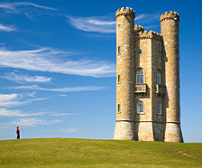
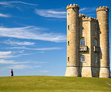
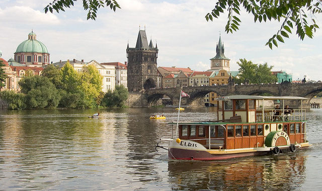
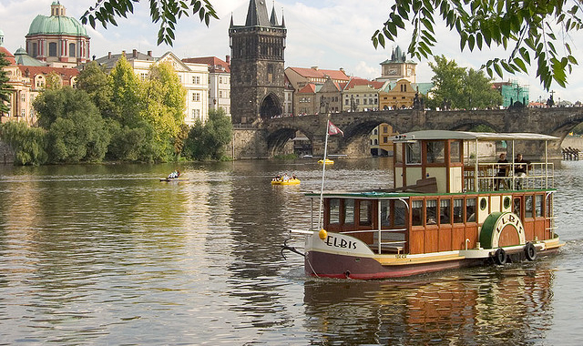
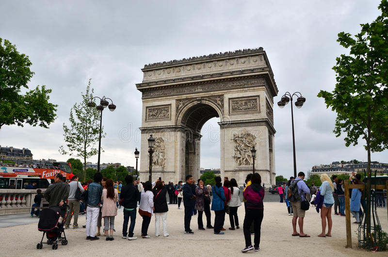
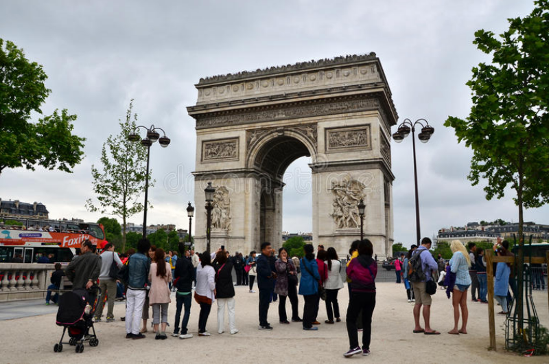
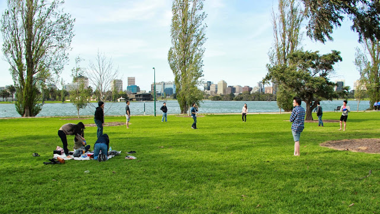
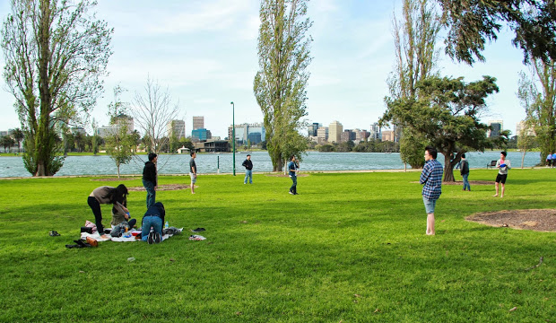

# Content_aware_resizing
Seam-carving for content-aware image resizing based on https://perso.crans.org/frenoy/matlab2012/seamcarving.pdf

## Width decrease 

- Original image

- Width decrease using OpenCV

- Width decrease using our algorithm

## Height decrease

- Original image

- Height decrease using OpenCV

- Height decrease using our algorithm

## Content amplification (using enlarging and then width/height decrease)

- Original 

- Content amplification using our algorithm

## Object elimination using ROI (Region of interest)

- Original image

- Examples of object elimination:

